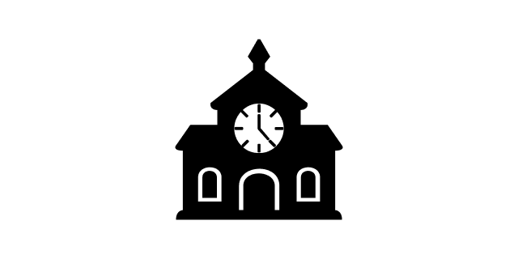
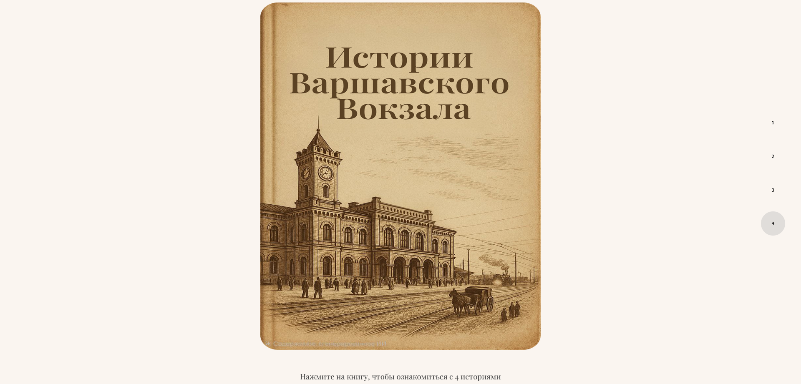

# Warsaw Railway Station

[Русская версия](./docs/readme/README-RU.md)

1. [About the project](#1-about-the-project)
2. [Technologies](#2-technologies)
3. [How to start](#3-how-to-launch)
4. [Implementation](#4-implementation)
5. [Book](#5-book)
6. [Team](#6-the-team)


[Open website](https://warsaw-railway-station.vercel.app/)

## 1. About the project

An interactive historical web project dedicated to the Warsaw Railway Station in Saint Petersburg.  
The project was developed as part of a university course and consists of a website with a visual
narrative and an interactive book telling the story of two brothers who were porters at the station in 1921.

## 2. Technologies
- React
- TypeScript
- Vite
- CSS / SCSS 

## 3. How to launch

1. Download the repository
```shell
git clone https://github.com/opie-official/Warsaw-Railway-Station.git
```
2. Download dependencies
```shell
npm i
```
3. Run and go to the desired address
```shell
npm run dev
```

## 4. Implementation

The following sections were created on the website:

1. Title page
2. Information about the station
3. Information about the project
4. Interactive book (with footer)

### Title page


The title page shows the name of the station and its image


### Information about the station

This section also contains an image of the station and four small blocks with brief information about the station.


### Information about the project

This section provides brief information about the project itself, along with its features.

### Interactive book

This section contains a closed book. Click on it to start reading stories ([more here](#book)).
### Footer

Service information


## 5. Book

The book has 4 pages, each of which tells different short stories.
When you click on the buttons at the bottom, the pages turn with a special animation.

The stories are presented below:


#### Предыстория

> Братья с самого детства жили только со своей любимой мамой.
Семья была не очень-то и состоятельна, братья всегда хотели порадовать чем-нибудь маму.
Узнав, что у нее скоро день рождения, они захотели купить ей красивый подарок.
Но семья их не богата - поэтому братья решили найти работу.


####  История 1 - как возвращали зонтик

> В один день, пока они работали на вокзале, их задел красиво одетый мужчина.
Извинившись перед красиво-одетым мужчиной, они обратили внимание на то,
что он оставил зонтик на лавочке. В их головах промелькнула мысль:
«оставить ли нам его или нет?». Однако они сразу вспомнили слова мамы о том,
что надо жить, по совести! Осознав ситуацию, они побежали искать его.
Осмотрев толпу, Братья увидели, как он собирался сесть в поезд.
Они окликнули мужчину, подбегая к нему. Он, услышав их, обернулся и решил подождать их,
не протягивая свой билет проводнице. Добежав до него и, запыхаясь,
они передали ему его потерянную вещь.


#### История 2 - как работали

> Мальчики, как обычно, работали: подсказывали дорогу, таскали вещи итд. Вдруг они увидели, как ко входу подъехала очень высокопоставленная дама. Братья подбежали к ней, решив, что смогу заработать денег, помогая ей донести ее вещи. Они предложили свою помощь – дама не отказала им и вдогонку сказала: «справитесь быстро – получите хорошие чаевые». Обрадовавшись, мальчики поспешили выполнить работу. Однако, в спешке они не обратили внимание, как из открытой сумки что-то выпало. Все вещи быстро принесли, и дама осталась довольна, и добавила им немного сверху (чего-то). Она села в вагон, не знав о потере дорогой ей вещи.


#### История 3 - как покупали подарок
>Братья, наконец-то закончив свой рабочий день и, получив плату за работу, решили проверить, сколько они накопили денег.  Они уже мечтали, как подарят своей маме подарок. Посчитав свои накопления, им стало ясно, что денег стало достаточно для подарка. Радостно они побежали к ларьку со сладостями. И вот они уже стояли перед ним и выбирали, что можно приобрести. Из кучи разных вкусных и красивых сладостей, их взгляд пал на торт, стоящий где-то сбоку на витрине. Но его только-что купила другая женщина. Увидев, что таких больше не осталось, они расстроились, но не отчаялись, и решили сделать заказ, еще красивее купленного. Братья спросили у продавца, можно ли сделать торт по нашему описанию. Продавец сказал им идти в пекарню за углом и там сделать заказ. И вот братья, придя в пекарню, говорят свои мысли кондитеру:
“Мы хотим высоченный многослойный торт, чередующийся с нежным и вкусным ванильным кремом, а внутри слой сметаны со сгущёнкой. Снаружи торт покрыт глазурью и украшен розочками из темного шоколада, а на самом торте написано посыпкой \“Мы тебя любим\”. Идеально для праздника”.
Мальчики на радостях от сказанного отдали все накопленные деньги кондитеру. Посчитав, кондитер понял, что немного не хватает, но, увидев счастливые лица мальчиков, он слегка улыбнулся и сказал  заходить за тортом через неделю.


## 6. The team

The project was completed by a team of four students as part of a course (I was responsible for creating the website itself).
