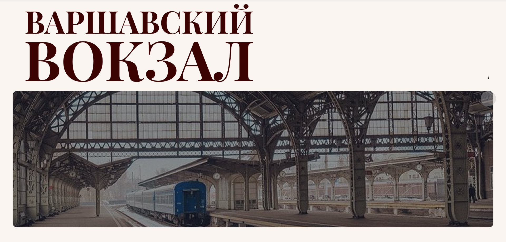
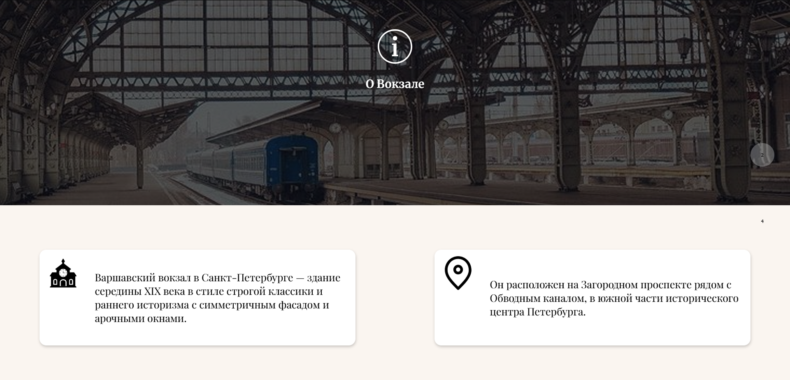
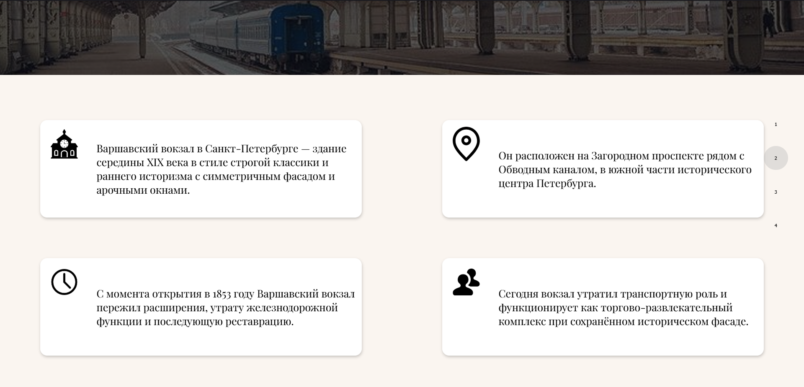
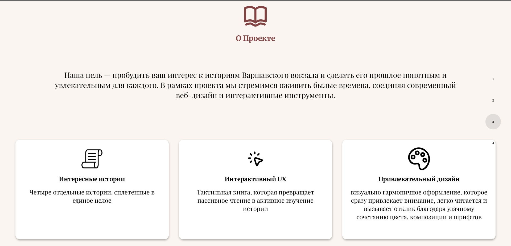
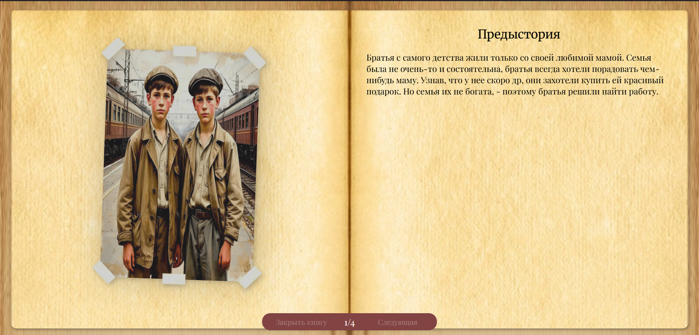

# Варшавский Вокзал

[English version](../../README.md)

1. [О проекте](#1-о-проекте)
2. [Технологии](#2-технологии)
3. [Как запустить](#3-как-запустить)
4. [Реализация](#4-реализация)
5. [Книга](#5-книга)
6. [Команда](#6-команда)


[Открыть сайт](https://warsaw-railway-station.vercel.app/)

## 1. О проекте

Интерактивный исторический веб-проект, посвящённый Варшавскому вокзалу в Санкт-Петербурге.  
Проект разработан в рамках университетского курса и представляет собой сайт с визуальным 
повествованием и интерактивной книгой, рассказывающей истории двух братьев — носильщиков вокзала в 1921 году.

## 2. Технологии

- React
- TypeScript
- Vite
- CSS / SCSS 

## 3. Как запустить

1. Скачать репозиторий
```shell
git clone https://github.com/opie-official/Warsaw-Railway-Station.git
```
2. Скачать зависимости
```shell
npm i
```
3. Запустить и перейти по нужному адресу
```shell
npm run dev
```

## 4. Реализация

На сайте были созданы следующие секции:

1. Титульный лист
2. Информация о вокзале
3. Информация о проекте
4. Интерактивная книга (вместе с футером)

### Титульный лист


На титульном листе представлено название вокзала и его изображение


### Информация о вокзале

В этой секции также находится изображение вокзала и 4 небольших блока с краткой информации о вокзале



### Информация о проекте

В этой секции представлена небольшая информация о самом проекте вместе с его особенностями.

### Интерактивная книга

В этой секции находится закрытая книга, нажав на которую, можно начать читать истории ([подробнее здесь](#5-книга))
### Футер

Служебная информация 


## 5. Книга

В книге есть 4 страницы, на каждой из которых рассказываются разные короткие истории. 
При нажатии кнопок снизу, страницы переворачиваются со специальной анимацией.

Истории представлены ниже:

#### Предыстория

> Братья с самого детства жили только со своей любимой мамой. 
Семья была не очень-то и состоятельна, братья всегда хотели порадовать чем-нибудь маму.
Узнав, что у нее скоро день рождения, они захотели купить ей красивый подарок.
Но семья их не богата - поэтому братья решили найти работу.


####  История 1 - как возвращали зонтик

> В один день, пока они работали на вокзале, их задел красиво одетый мужчина.
Извинившись перед красиво-одетым мужчиной, они обратили внимание на то, 
что он оставил зонтик на лавочке. В их головах промелькнула мысль: 
«оставить ли нам его или нет?». Однако они сразу вспомнили слова мамы о том,
что надо жить, по совести! Осознав ситуацию, они побежали искать его. 
Осмотрев толпу, Братья увидели, как он собирался сесть в поезд. 
Они окликнули мужчину, подбегая к нему. Он, услышав их, обернулся и решил подождать их, 
не протягивая свой билет проводнице. Добежав до него и, запыхаясь, 
они передали ему его потерянную вещь.


#### История 2 - как работали

> Мальчики, как обычно, работали: подсказывали дорогу, таскали вещи итд. Вдруг они увидели, как ко входу подъехала очень высокопоставленная дама. Братья подбежали к ней, решив, что смогу заработать денег, помогая ей донести ее вещи. Они предложили свою помощь – дама не отказала им и вдогонку сказала: «справитесь быстро – получите хорошие чаевые». Обрадовавшись, мальчики поспешили выполнить работу. Однако, в спешке они не обратили внимание, как из открытой сумки что-то выпало. Все вещи быстро принесли, и дама осталась довольна, и добавила им немного сверху (чего-то). Она села в вагон, не знав о потере дорогой ей вещи.


#### История 3 - как покупали подарок
>Братья, наконец-то закончив свой рабочий день и, получив плату за работу, решили проверить, сколько они накопили денег.  Они уже мечтали, как подарят своей маме подарок. Посчитав свои накопления, им стало ясно, что денег стало достаточно для подарка. Радостно они побежали к ларьку со сладостями. И вот они уже стояли перед ним и выбирали, что можно приобрести. Из кучи разных вкусных и красивых сладостей, их взгляд пал на торт, стоящий где-то сбоку на витрине. Но его только-что купила другая женщина. Увидев, что таких больше не осталось, они расстроились, но не отчаялись, и решили сделать заказ, еще красивее купленного. Братья спросили у продавца, можно ли сделать торт по нашему описанию. Продавец сказал им идти в пекарню за углом и там сделать заказ. И вот братья, придя в пекарню, говорят свои мысли кондитеру:
“Мы хотим высоченный многослойный торт, чередующийся с нежным и вкусным ванильным кремом, а внутри слой сметаны со сгущёнкой. Снаружи торт покрыт глазурью и украшен розочками из темного шоколада, а на самом торте написано посыпкой \“Мы тебя любим\”. Идеально для праздника”.
Мальчики на радостях от сказанного отдали все накопленные деньги кондитеру. Посчитав, кондитер понял, что немного не хватает, но, увидев счастливые лица мальчиков, он слегка улыбнулся и сказал  заходить за тортом через неделю.


## 6. Команда

Проект выполнен командой из 4 студентов в рамках учебного курса (я отвечал за создание самого сайта).
